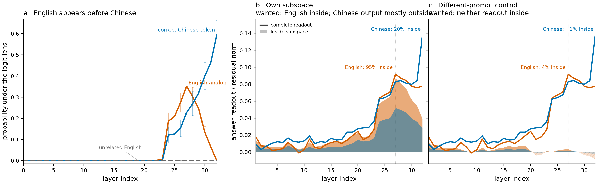

# A suppressed activation subspace isolates hidden English in Qwen

I was searching for a way to test whether [Wes Gurnee's](https://x.com/wesg52)
["suppression neurons"](https://arxiv.org/abs/2401.12181) can be found in the residual
stream.

For the test, I tried to isolate the suppressed English from the output language in the
["Do Llamas Work in English?"](https://arxiv.org/abs/2402.10588) plot.

This particular method works very well on Qwen3.5-4B.



*Figure 1: Language readouts at the final prompt position during Qwen3.5-4B
German-to-Chinese word translation. The line in every panel is the same mean logit-lens
probability over 105 input texts. Error bars in a are 95% Gaussian confidence intervals.
In b and c, the orange fill is the English probability multiplied by the signed share of
the linear English readout inside a rank-32 subspace, measured on the held-out 53 prompts.
This puts the diagnostic share against the familiar curve; it is not an additive
decomposition of probability. The gap below the orange line is the share outside the
subspace. Chinese is not filled because the two fills would overlap; its share at L32 is
printed instead. A useful detector fills English near L27 while keeping the printed
Chinese share low. The own-prompt subspace contains 0.947 of English at L27
and 0.205 of Chinese at L32. A fixed different-prompt pairing contains 0.040 and -0.015.
The subspace is constructed from vocabulary directions that rise and fall, so this remains
a correlational result rather than evidence that those directions cause suppression.*

## Where the idea came from

[Gurnee et al.](https://arxiv.org/abs/2401.12181) found prediction neurons through the
later layers, followed by suppression neurons near the output:

> We find a striking pattern which is remarkably consistent across the different seeds:
> after about the halfway point in the model, prediction neurons become increasingly
> prevalent until the very end of the network where there is a sudden shift towards a much
> larger number of suppression neurons.

[Wendler et al.](https://arxiv.org/abs/2402.10588) found a representation that follows
the same rise and fall:

> Neither the correct Chinese token nor its English analog garner any noticeable
> probability mass during the first half of layers. Then, around the middle layer, English
> begins a sharp rise followed by a decline, while Chinese slowly grows and, after a
> crossover with English, spikes on the last five layers.
>
> 


This gives us known content that is readable in the middle and suppressed before the
output: the English word for the answer.

## The method

I think of these as "words that are thought but not spoken." For each sample, project the
residual stream into vocabulary space and find token logits that rise in the middle but
fall before they can be sampled.

```python
z_early, z_peak, z_output = unembed(rmsnorm(h[[early, peak, output]]))

rise = center_over_vocab(z_peak - z_early)
fall = center_over_vocab(z_peak - z_output)
suppressed_score = minimum(relu(rise), relu(fall))

suppressed_tokens = topk(suppressed_score, k=32)
S = orthogonal_basis(center(unembedding[suppressed_tokens]).T)
h_suppressed = h @ S @ S.T
```

The vocabulary search chooses the directions. `S` is an orthonormal basis in the residual
stream. The complete PyTorch functions are in
[`suppressed_activation_subspace.py`](suppressed_activation_subspace.py).

```python
h_inside = component(h, S)
h_removed = remove(h, S, restore_norm=True)
h_amplified = steer(h, S, strength=0.5, restore_norm=True)
h_replaced = replace(h, S, h_target, S_target, restore_norm=True)
```

These operations depend on the projector `S @ S.T`, not the individual QR columns. The
extraction is sample-specific and needs an unmodified residual trajectory through the
output layer. You can then read or modify that same trajectory. Applying it during
open-ended generation requires an unsteered first pass or a basis learned from other
samples.

The method receives no English or Chinese answer tokens. On the held-out half of this run,
its top-32 vocabulary rows contain an English answer token for 42 of 53 prompts and a
Chinese answer token for 1 of 53.

| prompt gets subspace from | signed share: English at L27 | signed share: Chinese at L32 |
|---|---:|---:|
| same prompt | **0.947** | 0.205 |
| different prompt | 0.040 | -0.015 |

These are signed shares of a readout, so they need not lie between zero and one. A negative
share points against the full readout.

## Are suppressed activations causal? Can changing this subspace change the answer?

To test this, we repeat the spider/dog version of the demonstration in [Gurnee et al.,
Figures 12–13](https://transformer-circuits.pub/2026/workspace/#fig-latent-patching)
using our suppressed-activation method.

### Before intervention

Prompt: **Fact: The number of legs on the animal that spins webs is**

Suppressed readout: `[丝绸, -web, Web, Disc, 的战, Spider, web, WEB]`

The unspoken `Spider` appears in the readout, and the model answers `8`.

| rank | token | log p | p |
|---:|:---|---:|---:|
| 1 | **8** | **−0.125** | **0.883** |
| 2 | 4 | −2.875 | 0.056 |
| 3 | 6 | −3.625 | 0.027 |
| 4 | 1 | −4.625 | 0.010 |
| 5 | 2 | −5.000 | 0.007 |
| 6 | 3 | −5.125 | 0.006 |
| 7 | 5 | −5.625 | 0.004 |
| 8 | 7 | −5.750 | 0.003 |
| 9 | 0 | −6.500 | 0.002 |
| 10 | 9 | −6.562 | 0.001 |

### Replace the suppressed component

A separate target prompt gives us a dog-related component:

Target prompt: **Fact: The number of legs on the animal that barks and is called man's best friend is**

Target suppressed readout: `[吠, собаки, 狗粮, dog, Dog, Dog, สุนัข, canine]`

This is the target prompt's readout, not the source prompt's readout after intervention. We
extract both subspaces with unmodified forward passes, then change one residual vector at
L26 and the final source-prompt token:

```python
source = h_spider @ S_spider @ S_spider.T
target = h_dog @ S_dog @ S_dog.T
target = target * norm(source) / norm(target)
h_replaced = match_norm(h_spider + C * (target - source), h_spider)
```

`C=1` is the constructed replacement and still answers `8`. The result below uses `C=4`,
a large extrapolation past the replacement.

### After intervention

Prompt: **Fact: The number of legs on the animal that spins webs is**

Re-extracted suppressed readout: `[Silk, Spider, spiders, 丝绸, silk, -web, spider, Spider]`

The prompt is unchanged, the readout still looks spider-related, but the top answer changes
to `4`.

| rank | token | log p | p |
|---:|:---|---:|---:|
| 1 | **4** | **−0.713** | **0.490** |
| 2 | 8 | −1.213 | 0.297 |
| 3 | 6 | −2.338 | 0.097 |
| 4 | 1 | −3.213 | 0.040 |
| 5 | 2 | −3.963 | 0.019 |
| 6 | 5 | −4.088 | 0.017 |
| 7 | 3 | −4.213 | 0.015 |
| 8 | 9 | −4.338 | 0.013 |
| 9 | 7 | −4.713 | 0.009 |
| 10 | 0 | −6.588 | 0.001 |

This does not establish a semantic `spider → dog` swap. C=4 changes 72% of the residual
norm, 21 of 256 matched-random interventions have an equal or larger effect, and a target
prompt for `2 + 2` produces the same answer change. The supported result is a
prompt-specific next-answer-state intervention. The [executed
notebook](nbs/demo.ipynb) contains this single demo, and the [fixed run
report](out/2026-09-05_211609_causal-confirmation/recovered_log.md) contains the controls.

## Limits

- This is a diagnostic result. It does not yet show that the subspace causes hidden English
  computation or suppression.
- The method uses the LM head to find the subspace and to measure its contents.
- The three layers were chosen from the aggregate English curve. A transfer test should
  choose them on held-in prompts or use a fixed model-level rule.
- Each trajectory gets its own subspace. The different-prompt control shows that the basis
  is mostly path-dependent. An intervention on the same sample can use an unsteered first
  pass; a transferable intervention would need to combine many extraction trajectories.
- The English-only demo settings came from a 64-condition layer, rank, and dose screen.
  C=4 changes 68–72% of the residual norm and is an extrapolation. The demo does not
  estimate a held-out success rate.
- The C=4 answer changes did not meet the preregistered matched-random criterion. Arithmetic
  target prompts reproduced them, so the supported interpretation is next-answer-state
  transfer rather than animal identity.

## Try it in a notebook

[`nbs/demo.ipynb`](nbs/demo.ipynb) is an executed Qwen3.5-4B notebook paired with the
editable [`nbs/demo.py`](nbs/demo.py). It reproduces the single spider-to-dog example above:
the two prompt-specific readouts, the residual replacement, and the before/after top-token
tables.

```bash
just notebook-run
```

## Reproduce the figure

```bash
uv run scripts/figure.py
```

The plotted aggregates and their provenance are in [`data/`](data/). The SVG version is
[`figs/suppressed_activations.svg`](figs/suppressed_activations.svg).

## Citation

If you use the method or figure, please cite
[`CITATION.cff`](CITATION.cff). GitHub exposes this as **Cite this repository**.

## References

- Gurnee, Wes, et al. ["Universal Neurons in GPT2 Language Models."](https://arxiv.org/abs/2401.12181) 2024.
- Wendler, Chris, et al. ["Do Llamas Work in English? On the Latent Language of Multilingual Transformers."](https://arxiv.org/abs/2402.10588) 2024.
- Gurnee, Wes, et al. ["Verbalizable Representations Form a Global Workspace in Language Models."](https://transformer-circuits.pub/2026/workspace/) 2026.

<!-- Drafted from Michael J. Clark's public thread and edited by PI/claude-opus-4.6 and PI/gpt-5.4. -->
