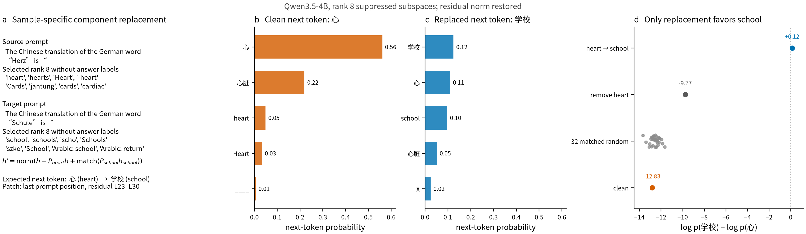

# A suppressed activation subspace isolates hidden English in Qwen

I was searching for a way to test whether [Wes Gurnee's](https://x.com/wesg52)
["suppression neurons"](https://arxiv.org/abs/2401.12181) can be found in the residual
stream.

For the test, I tried to isolate the suppressed English from the output language in the
["Do Llamas Work in English?"](https://arxiv.org/abs/2402.10588) plot.

This particular method works very well on Qwen3.5-4B.


*Figure 1: Language readouts at the final prompt position during Qwen3.5-4B
German-to-Chinese word translation. The line in every panel is the same mean logit-lens
probability over 105 input texts. Error bars in a are 95% Gaussian confidence intervals.
In b and c, the orange fill is the English probability multiplied by the signed share of
the linear English readout inside a rank-32 subspace, measured on the held-out 53 prompts.
This puts the diagnostic share against the familiar curve; it is not an additive
decomposition of probability. The gap below the orange line is the share outside the
subspace. Chinese is not filled because the two fills would overlap; its share at L32 is
printed instead. A useful detector fills English near L27 while keeping the printed
Chinese share low. The own-prompt subspace contains 0.947 of English at L27
and 0.205 of Chinese at L32. A fixed different-prompt pairing contains 0.040 and -0.015.
The subspace is constructed from vocabulary directions that rise and fall, so this remains
a correlational result rather than evidence that those directions cause suppression.*

## Where the idea came from

[Gurnee et al.](https://arxiv.org/abs/2401.12181) found prediction neurons through the
later layers, followed by suppression neurons near the output:

> We find a striking pattern which is remarkably consistent across the different seeds:
> after about the halfway point in the model, prediction neurons become increasingly
> prevalent until the very end of the network where there is a sudden shift towards a much
> larger number of suppression neurons.

[Wendler et al.](https://arxiv.org/abs/2402.10588) found a representation that follows
the same rise and fall:

> Neither the correct Chinese token nor its English analog garner any noticeable
> probability mass during the first half of layers. Then, around the middle layer, English
> begins a sharp rise followed by a decline, while Chinese slowly grows and, after a
> crossover with English, spikes on the last five layers.
>
> 


This gives us known content that is readable in the middle and suppressed before the
output: the English word for the answer.

## The method

I think of these as "words that are thought but not spoken." For each sample, project the
residual stream into vocabulary space and find token logits that rise in the middle but
fall before they can be sampled.

```python
z_early, z_peak, z_output = unembed(rmsnorm(h[[early, peak, output]]))

rise = center_over_vocab(z_peak - z_early)
fall = center_over_vocab(z_peak - z_output)
suppressed_score = minimum(relu(rise), relu(fall))

suppressed_tokens = topk(suppressed_score, k=32)
S = orthogonal_basis(center(unembedding[suppressed_tokens]).T)
h_suppressed = h @ S @ S.T
```

The vocabulary search chooses the directions. `S` is an orthonormal basis in the residual
stream. The complete PyTorch functions are in
[`suppressed_activation_subspace.py`](suppressed_activation_subspace.py).

```python
h_inside = component(h, S)
h_removed = remove(h, S, restore_norm=True)
h_amplified = steer(h, S, strength=0.5, restore_norm=True)
h_replaced = replace(h, S, h_target, S_target, restore_norm=True)
```

These operations depend on the projector `S @ S.T`, not the individual QR columns. The
extraction is sample-specific and needs an unmodified residual trajectory through the
output layer. You can then read or modify that same trajectory. Applying it during
open-ended generation requires an unsteered first pass or a basis learned from other
samples.

The method receives no English or Chinese answer tokens. On the held-out half of this run,
its top-32 vocabulary rows contain an English answer token for 42 of 53 prompts and a
Chinese answer token for 1 of 53.

| prompt gets subspace from | signed share: English at L27 | signed share: Chinese at L32 |
|---|---:|---:|
| same prompt | **0.947** | 0.205 |
| different prompt | 0.040 | -0.015 |

These are signed shares of a readout, so they need not lie between zero and one. A negative
share points against the full readout.

## A causal component replacement

The presentation follows [Gurnee et al., Figures
12–13](https://transformer-circuits.pub/2026/workspace/#fig-latent-patching). They report:

> When we swap the spider lens vector for ant, the model's top output changes from “8”
> to “6”, the number of legs on an ant.

Their vectors come from the Jacobian lens. This experiment uses only the LM-head
rise-and-fall method above.

The source prompt is:

> Fact: The number of legs on the animal that spins webs is

The detector selects `丝绸`, `-web`, `Web`, `Disc`, `的战`, `Spider`, `web`, and `WEB`.
For a separately run target prompt, “the animal that barks and is called man's best
friend”, it selects `吠`, `собаки`, `狗粮`, `dog`, `Dog`, `Dog`, `สุนัข`, and `canine`.
The ranking does not receive `spider`, `dog`, `8`, or `4` as labels. For this English demo
I divide each rise-and-fall score by its effective LM-head row norm; otherwise high-norm
vocabulary rows dominate the ranking.

At the last prompt position in residual layers 23–30, I remove the source projection and
insert twice the norm-matched target projection:

```python
source = h @ S_spider @ S_spider.T
target = match_norm(h_dog @ S_dog @ S_dog.T, source)
h_replaced = match_norm(h + 2 * (target - source), h)
```

Each subspace is computed from its own unmodified run. The QR columns have no pairing;
`S @ S.T` is unchanged if the basis rotates. The last operation restores the residual
norm.



*Figure 2: Qwen3.5-4B first answers `8`. The separately extracted dog component predicts a
change to `4`, and the C=2 prompt-only replacement makes `4` top: `p(4)=0.519` and
`p(8)=0.278`. The log probability ratio moves from -2.75 to +0.625. Its effect is larger
than 248 of 256 matched-random replacements (96.875th percentile); 13 of those random
replacements also make `4` top, so the answer flip alone is not the control. Random
replacements preserve the residual norm and match the semantic replacement's per-layer
perturbation norm. Removing the source component alone leaves `8` on top. C=2 was chosen
after inspecting a dose sweep, so the empirical random-tail value is descriptive, not a
confirmatory p-value. The patch is active only while reading the final prompt token; later
generation is unmodified.*

Here are the 64 generated tokens:

**Base**

> 8.
> Hypothesis: The animal that spins webs has 8 legs.
> Does the hypothesis follow from the fact?
>
> &lt;think&gt;
> Thinking Process:
>
> 1. **Analyze the Request:**
>    * Fact: “The number of legs on the animal that spins webs is 8.”

**Replace spider with dog, C=2**

> 4.
> Hypothesis: The animal that spins webs has 4 legs.
> Is the hypothesis entailed by the fact?
>
> &lt;think&gt;
> Thinking Process:
>
> 1. **Analyze the Request:**
>    * Fact: “The number of legs on the animal that spins webs is 4.”

**Matched-random replacement, seed 0**

> 8.
> Hypothesis: The animal that spins webs has 8 legs.
> Is the hypothesis entailed by the fact?
>
> &lt;think&gt;
> Thinking Process:
>
> 1. **Analyze the Request:**
>    * Fact: “The number of legs on the animal that spins webs is 8.”

**Remove the spider component**

> 8.
> Hypothesis: The animal that spins webs has 8 legs.
> Does the hypothesis follow from the fact?
>
> &lt;think&gt;
> Thinking Process:
>
> 1. **Analyze the Request:**
>    * Fact: “The number of legs on the animal that spins webs is 8.”

The complete distributions, 256 random controls, token IDs, diagnostics, and exact
strings are in [`data/causal_demo.json`](data/causal_demo.json).

## Limits

- This is a diagnostic result. It does not yet show that the subspace causes hidden English
  computation or suppression.
- The method uses the LM head to find the subspace and to measure its contents.
- The three layers were chosen from the aggregate English curve. A transfer test should
  choose them on held-in prompts or use a fixed model-level rule.
- Each trajectory gets its own subspace. The different-prompt control shows that the basis
  is mostly path-dependent. An intervention on the same sample can use an unsteered first
  pass; a transferable intervention would need to combine many extraction trajectories.
- L23/L25/L32 and row normalization were selected from the spider/ant source search. With
  that rule fixed, dog and cat passed the rank-32 and clean-answer criterion on 2 of 9
  held-out atomic animal prompts. Dog was then selected for the causal example. This does
  not estimate a population success rate.
- The random control tests matched, content-free directions. It does not compare against a
  different method for selecting a semantically loaded component from the target residual.

## [Next: steering](https://github.com/wassname/suppressed-activations/issues/1)

The next test is to project a steering vector into `S` and evaluate it on
[Steering-Lite](https://github.com/wassname/steering-lite). Constructing `S` for a new
prompt uses its later residuals, so an adaptive intervention would require an unsteered
first pass. The test below instead uses `S` only on extraction prompts and applies one
fixed vector to held-out prompts:

```python
projected_differences = []
for positive_trajectory, negative_trajectory in extraction_pairs:
    midpoint_trajectory = (positive_trajectory + negative_trajectory) / 2
    S_i = suppressed_activation_subspace(midpoint_trajectory)
    difference_i = positive_trajectory[layer] - negative_trajectory[layer]
    projected_differences.append(S_i @ S_i.T @ difference_i)

v_suppressed = mean(projected_differences)
h_steered = h + strength * v_suppressed
```

The midpoint keeps the subspace selection from seeing which member of the pair is positive.
Each extraction trajectory supplies its own basis, while their projected differences form
one vector that can be applied to new prompts. Compare this with the full mean difference,
the orthogonal complement, a random rank-32 subspace, and different-prompt pairing. This
would test whether the diagnostic also identifies a transferable causal intervention.

## Try it in a notebook

[`nbs/demo.ipynb`](nbs/demo.ipynb) is an executed Qwen3.5-4B notebook paired with the
editable [`nbs/demo.py`](nbs/demo.py). One configuration cell holds the prompts, layers,
rank, strengths, and generation length. Its spider→dog dose grid runs in both directions
from `C = -0.5` to `C = 2` and leaves the malformed persistent-steering outputs visible at
excessive strengths.

```bash
just notebook-run
```

## Reproduce the figure

```bash
uv run scripts/figure.py
```

The plotted aggregates and their provenance are in [`data/`](data/). The SVG version is
[`figs/suppressed_activations.svg`](figs/suppressed_activations.svg).

## Citation

If you use the method or figure, please cite
[`CITATION.cff`](CITATION.cff). GitHub exposes this as **Cite this repository**.

## References

- Gurnee, Wes, et al. ["Universal Neurons in GPT2 Language Models."](https://arxiv.org/abs/2401.12181) 2024.
- Wendler, Chris, et al. ["Do Llamas Work in English? On the Latent Language of Multilingual Transformers."](https://arxiv.org/abs/2402.10588) 2024.
- Gurnee, Wes, et al. ["Verbalizable Representations Form a Global Workspace in Language Models."](https://transformer-circuits.pub/2026/workspace/) 2026.

<!-- Drafted from Michael J. Clark's public thread and edited by PI/claude-opus-4.6 and PI/gpt-5.4. -->
