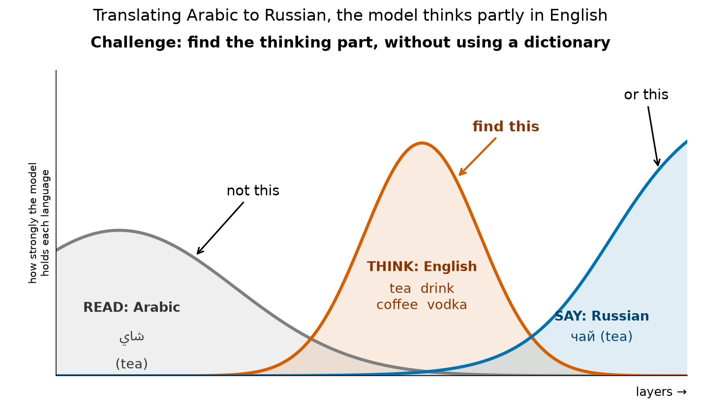

# Hidden Thought Challenge: find the concepts in giant inscrutable matrices



In AI models we want to find the thoughts and concepts and planning. It should be possible: unlike humans, we have every single byte of "brain activity" available in giant inscrutable tensors. The problem is that we don't understand them.

The goal is to find a way to isolate the subspace with concepts. We have a nice and quick way to test it.

If we could crack this, it would change many things. We could steer models toward genuine concepts like virtue using their own capable internal concepts. 

## How we test it: translation

There is a delightful finding from the paper ["Do Llamas Work in English?"](https://arxiv.org/abs/2402.10588). When a multilingual model translates between two non-English languages, say Russian to Korean, it often appears to think in English along the way. It takes a detour through English concepts.

This is our way in. If a model translating Arabic to Hindi reliably activates English words in its hidden states, we have a target to aim at.

<details><summary>Background: the "Do Llamas Work in English?" plot</summary>

I was searching for a way to test whether [Wes Gurnee's](https://x.com/wesg52)
["suppression neurons"](https://arxiv.org/abs/2401.12181) can be found in the residual
stream.

For the test, I tried to isolate the suppressed English from the output language in the
["Do Llamas Work in English?"](https://arxiv.org/abs/2402.10588) plot.


*Llama-2-70B translating into Chinese ([Wendler et al. 2024](https://arxiv.org/html/2402.10588v4), Fig. 2): the English word (orange) rises mid-network, then falls as the Chinese answer (blue) rises.*


</details>

## No dictionaries

Of course we can't cheat and find the English words by looking up English words. We are searching for a calculation that precisely isolates the activation subspace that corresponds to English words, but not to other languages. This way any winning calculation will generalise to other settings.

We use Qwen3.5-4B, a model trained mostly on English and Chinese. We only test translation between Russian, Korean, Arabic, Hindi and Thai. We never use English or Chinese as the input or output language, but if the hidden word shows up in either, we count it.

## Leaderboard

A method gets the model's activations and must return a vector that holds the hidden English word. It may not use the
output head, token lists or dictionaries; we use the output head only afterwards, to read out the top 8 words and check
them.

On each prompt the method succeeds if the hidden word is in the top 8 and no input- or output-language word is.
The score is F1: 1.00 means every prompt succeeded.

| method                                                         |      F1↑ | found the hidden word↑ | showed input/output words↓ | English-only F1↑ | fitted on   |
|:---------------------------------------------------------------|---------:|-----------------------:|---------------------------:|-----------------:|:------------|
| [remove this prompt's early and output states](scripts/challenge/transforms.py#L253)       | **0.92** |                    93% |                     **9%** |             0.00 | nothing     |
| [layer-change PCA](scripts/challenge/transforms.py#L164)                                   |     0.91 |                **95%** |                        14% |             0.00 | WikiText    |
| [net-change PCA](scripts/challenge/transforms.py#L189)                                     |     0.90 |                    93% |                        14% |             0.00 | WikiText    |
| *[logit lens (activations unchanged)](scripts/challenge/transforms.py#L139)*               |     0.87 |                    93% |                        22% |         **0.03** | nothing     |
| *[random subspace (control)](scripts/challenge/transforms.py#L159)*                        |     0.85 |                    89% |                        21% |             0.00 | random seed |

The model is Qwen3.5-4B. The test has 149 prompts over four language pairs (Arabic→Hindi, Hindi→Thai, Thai→Russian,
Korean→Arabic). Each method's layer and size were picked on a different pair (Russian→Korean) before the test.
English-only F1 uses 102 two-hop questions where nothing is translated. Differences under about 0.03 are within noise.
[All methods, confidence intervals and details](docs/leaderboard.md).


Each panel shows one method at every layer. Dark orange is what we want: the hidden word, with nothing from the
input or output language. With the plain logit lens much of the orange is light: the hidden word is there, but so is
the output language. The best methods turn more of it dark. The hidden word is only readable between about layers 24
and 30. Before that the model has not formed it; after that it is replaced by the output.

The best method so far is also the simplest. Take the activation at layer 28, and remove the direction of the same
prompt's activation at layer 22 (still close to the input) and at the last layer (the output). It needs no fitting.
It finds the hidden word as often as the logit lens, but shows input or output words on 9% of prompts instead of 22%.

No method works on English-only questions, where the input and output are already English: the best F1 is under 0.10.
That is the open problem. If we can solve that, we might have a general way to read what a model thinks.

## Enter

Add a `@geometry` function to [`transforms.py`](scripts/challenge/transforms.py). It gets the activations and returns a vector in activation
space:

```python
@geometry("my subspace", settings=[(27, 256), (28, 256)], fitted="WikiText")
def mine(s, layer, rank):  # s["res"]: the activations at the last prompt token, one row per layer, shape [33, 2560]
    return project(bases["my basis"][:, :rank], s["res"][layer])  # return one vector, shape [2560]
```

`s["attn"]` is also there: the output of the attention block at layer 23. If your method needs a basis fitted on
text, add it in `fit_bases()`. Then run, on one GPU:

```sh
uv run scripts/challenge/score.py  # downloads the model and data on first run
```

To see your method at every layer, as in the figure above, add it to `METHODS` in
[`notebook.py`](scripts/challenge/notebook.py). It opens as a notebook.

Rules:

- Return a vector in activation space. Do not use the output head, token ids, logits, word lists, dictionaries or
  language labels. The scorer uses the output head afterwards, only to check the answer.
- You may fit on generic text, like the WikiText sample in `data/challenge/`, and use the model's other weights.
- Put every setting you tried in `settings`. The scorer picks the best one on Russian→Korean and uses only that one on
  the test.
- If two methods differ by less than their confidence intervals, we treat them as tied. We may also test entries on
  other language pairs.

Open an issue or a pull request with your method and its score, and we will add it to the leaderboard.
<!-- Leaderboard and Enter text rewritten for plain reading by PI/OpenAI, 2026-10-05, from out/2026-10-05_002148_leaderboard. -->

## Related work

- [Dumas et al. 2024](https://arxiv.org/abs/2411.08745) use the same word-translation setup and patch activations: "we can change the concept without changing the language and vice versa through activation patching alone."
- [Bayazit et al. 2026](https://arxiv.org/abs/2609.00155) compare probes: "decoding-based probes, which rely on output-space decodability, retain sharper language-specific and more English-biased signals."
- [Schut et al. 2025](https://arxiv.org/abs/2502.15603) find an English pivot in open-ended generation.
- [Wu et al. 2024](https://arxiv.org/abs/2411.04986) describe a shared middle-layer "semantic hub" across languages.
- [Zhong et al. 2025](https://aclanthology.org/2025.findings-acl.1350/) find that models trained on several languages can use more than one latent language.
- [Yang et al. 2024](https://aclanthology.org/2024.acl-long.550.pdf) made TwoHopFact, the English-only questions here.
- [Patchscopes](https://arxiv.org/abs/2401.06102), [LatentQA](https://arxiv.org/abs/2412.08686) and the [tuned lens](https://arxiv.org/abs/2303.08112) are other readouts.

<!-- PI/OpenAI 2026-10-04: table from out/2026-10-05_002148_leaderboard, generated by scripts/challenge/score.py. -->

## Citation

If you use the method or figure, please cite
[`CITATION.cff`](CITATION.cff). GitHub exposes this as **Cite this repository**.

## References

- Gurnee, Wes, et al. ["Universal Neurons in GPT2 Language Models."](https://arxiv.org/abs/2401.12181) 2024.
- Wendler, Chris, et al. ["Do Llamas Work in English? On the Latent Language of Multilingual Transformers."](https://arxiv.org/abs/2402.10588) 2024.
- Gurnee, Wes, et al. ["Verbalizable Representations Form a Global Workspace in Language Models."](https://transformer-circuits.pub/2026/workspace/) 2026.

<!-- Drafted from Michael J. Clark's public thread and edited by PI/claude-opus-4.6 and PI/gpt-5.4.
2026-09-29 restructure by Claudypoo[opus-4.8]: challenge framing, results table, collapsed demos. -->
